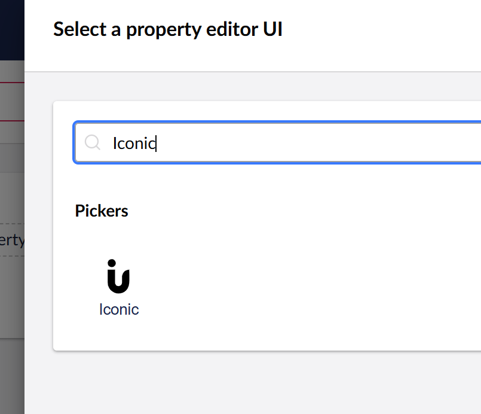
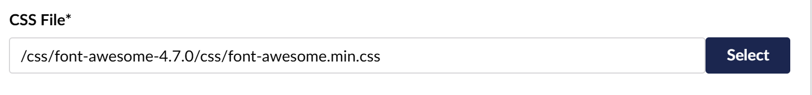
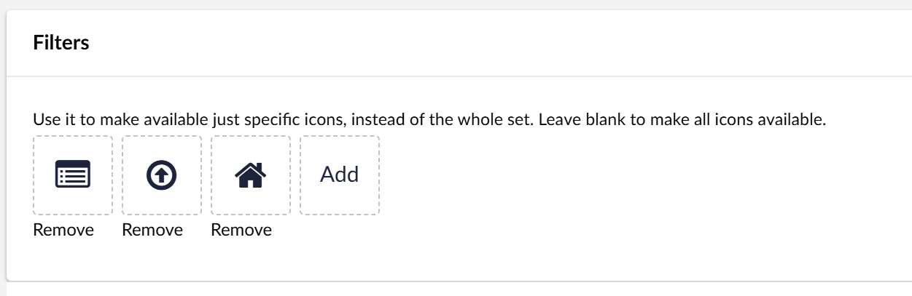
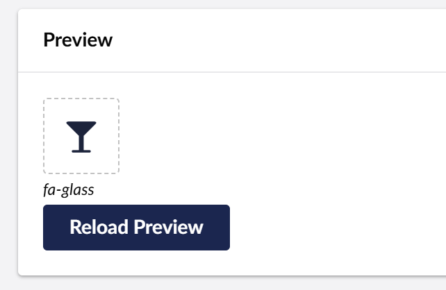
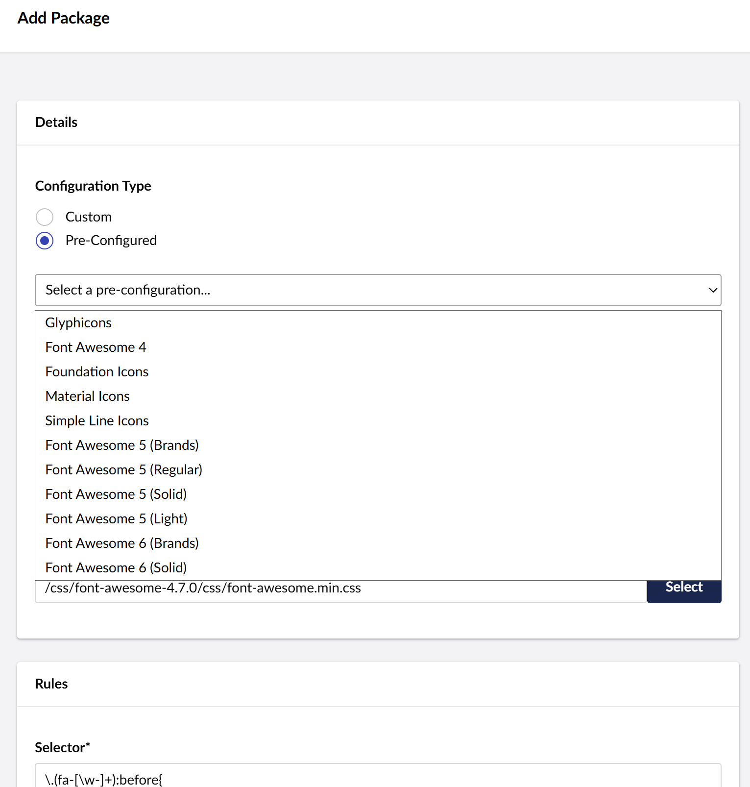

# Iconic Configuration


## Contents

[Create a new DataType](#create)

[Configuration Options](#options)

[Pre-configured packages](#preconfigured)

Specific Icon Sets Configurations:
-  [Font Awesome 4](FontAwesome4)
-  [Font Awesome 5](FontAwesome5)
-  [Glyphicons](Glyphicons)
-  [Material Icons](MaterialIcons)
-  [Material Symbols](MaterialSymbols)


## <a name="create"></a> Create a new DataType
You have to create a new datatype from the Iconic editor:
1. Go to the Developer section.
2. Right click on *DataTypes*, click *Create* and click on *New data type*.
3. Enter a name for your datatype and select Iconic from the *Property Editor* dropdown.




## <a name="options"></a>Configuration Options


### Template 
This will be the template your icon will be based on. You can use the value ```{icon}``` as placeholder for your icon specific rule. For instance, for Font Awesome you should enter something like: `<i class="fa {icon}"></i>`

#### Placeholders
You can use the following placeholders to customize the way your icon is rendered in the frontend:
- *\{icon\}* : Here is where the specific icon rule will be included. For instance, for a Font Awesome icon you would do ```<i class="fa {icon}"></i>```
- *\{classes\}*: You can add extra classes to your icon from your views. See [Displaying the Icon](../Usage)
- *\{attributes}*: You can use this placeholder to add extra attributes to your icon from your views. This can be useful to add data attributes for instance among other things. See [Displaying the Icon](../Usage)


### Override Backoffice template. Optional.
You can override the Template value to use different templates for frontend and backoffice.

### CSS file


This field allows you to configure the CSS that will be loaded on your backoffice when using Iconic.

You can use absolute paths: http:\\\www.yoursite.com\styles\fonts\my-font-package.css. This allows you to use external files, like the ones from a CDN.

Or relative to the root: \styles\fonts\my-font-package.css This file will be loaded in the head of your backoffice and will affect the whole view so be careful of what you load there. Check the Known Issues section for some more info.

Use the Select button to pick files from your local installation.

### Icons source file
This file will be used to extract the specific configuration for each different icon. Usually this is the same as the CSS file but it can be different.

To extract the rules the regex configured on the Template input rule will be used. This file will normally be a CSS file where the rules are contained. You can use absolute or relative paths.

Use the Select button to pick files from your local installation.

For example, some packages like Font Awesome use css rules to apply the specific icon:
```
<i class="fa fa-glass"></i> (Template: <i class="fa {icon}"></i>)
```

Other packages like Material Icons use the glyph codes or even ligatures to display the icon instead a specific css selector. 
```
<i class="material-icons">alarm</i> (Template: <i class="material-icons">{icon}</i>)
```
So this file can be the same css file or another files use to extract the icons property. In the case of Material Icons for instance there is a file called <a href="https://github.com/google/material-design-icons/blob/master/iconfont/codepoints">codepoints</a> where you can extract the icons names from.

### Filter
You can restrict the icons that are available for selection. Using the filter option, click on Add and you will get a list with all the extracted icons from your package.



### Icon Preview
If everything is configured properly, and Iconic can extract a list of your icons, you will be able to preview your configured Template. Click the Reload Preview button and you should get a preview of the first icon found on your source file.

**Cool tip:** you can preview changes to your template in real time (no need to click *Reload preview*) :boom: 



## <a name="preconfigured"></a>Pre configured packages
To make your life easier we have included some help to configure your packages in the form of pre-configured packages. If you select *Pre-Configured* when creating your package, you will have access to a list of pre-configured ones. You will still have to enter your css file path.




You can add as many packages you like. You can also arrange their order or remove those you don't want to use anymore.

**Note**: the regex included in the preconfigs are valid for the **minimised versions** of them.

### Saving your configuration
Click the *Add Package* button to add the configuration to your packages listing. Before adding the package, Iconic will extract the css rules from the file using the regex selector. Some checking is ran that will let you know if something went wrong with your configuration.