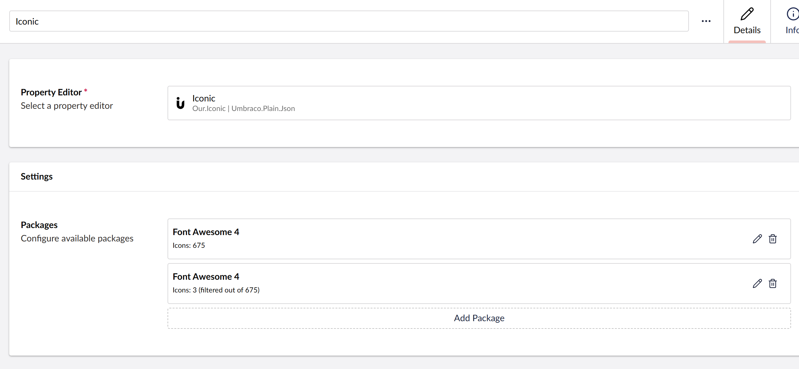
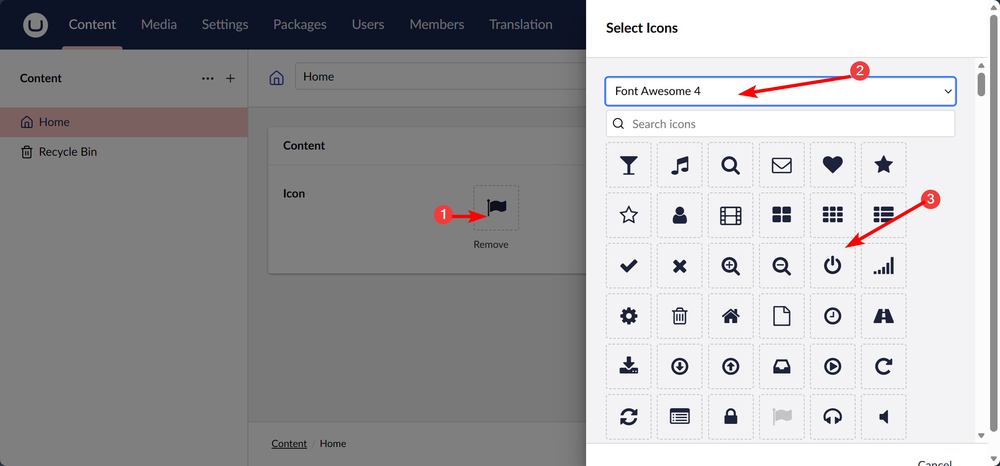

# Iconic Datatype Usage and Rendering Icons


## Contents

[Using the DataType](#using)

[Displaying the icon](#displaying)

## <a name="using"></a> Using the DataType
Once you have configured your datatype, you can use it as a property editor.



To add or modify your icon just click on the placeholder, this will open a dialog where you can select form your configured packages. Once a package is selected, all the icons will be displayed below.




## <a name="displaying"></a> Displaying the icon
Iconic comes with a value converter that will return a HtmlString containing the icon html. So you just have to use the model of your template like so:

```
@Html.Raw(Model.MyIcon)
```

Remember to wrap the icon in `Html.Raw` so Razor displays the returned html properly.


There is a second way of rendering your icon that allow you to add extra classes and attributes from your views. Remember that you need to add the placeholders on the right place of your template when you configure Iconic.


Example:

    // just render the icon
    @Model.Icon.RenderIcon()

    // or include additional parameters or classes
    @Model.Icon.RenderIcon("dataX='mydata'", "myclass")


If you had a template like `<i class="fa {icon} {classes} fa-5x" {attributes}></i>` This will render to:

     <i class="fa fa-power-off myclass fa-5x" data-x="mydata"></i>

ℹ️ Note that to render `data-x` you have to enter `dataX` as your attribute name.


